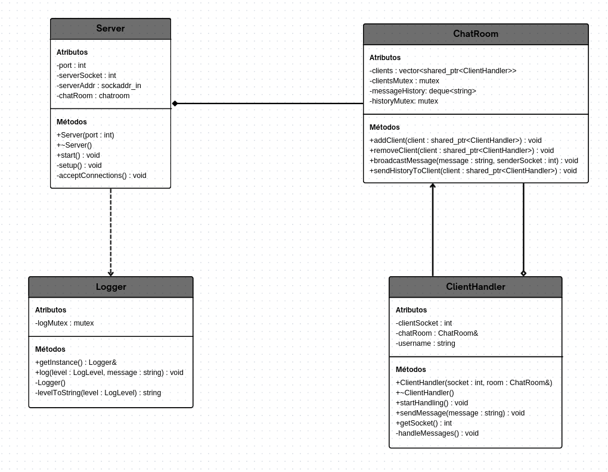

# Relatório - Trabalho Final LP2

## Mapeamento Requisitos-Código

Esta seção mapeia cada requisito geral do projeto para a sua respectiva implementação no código-fonte.

### 1. Threads
O projeto utiliza `std::thread` extensivamente. A classe **ClientHandler** inicia uma nova thread para cada cliente na função `startHandling()`, permitindo o gerenciamento concorrente de múltiplas conexões. O **Cliente** também usa duas threads: uma para enviar (`send_messages`) e outra para receber (`receive_messages`).

### 2. Exclusão Mútua
A exclusão mútua é garantida pelo uso de `std::mutex` e `std::lock_guard` / `std::scoped_lock`. A classe **Logger** usa um mutex para proteger o acesso ao console. A **ChatRoom** usa mutexes para proteger os recursos compartilhados: a lista de clientes (`clientsMutex`) e o histórico de mensagens (`historyMutex`).

### 3. Semáforos e Condvars
Embora não usados diretamente, o conceito de sincronização é implementado pelos mutexes que controlam o acesso a seções críticas, cumprindo o objetivo de controle e sincronização.

### 4. Monitores
A classe **ChatRoom** foi projetada como um monitor. Ela encapsula os dados compartilhados (clientes e histórico) e os mutexes que os protegem, expondo uma interface pública e segura (`addClient`, `broadcastMessage`, etc.) para manipulação desses dados.

### 5. Sockets
A  comunicação em rede é implementada usando a _API de Sockets Berkeley_. O **Server** usa `socket()`, `bind()`, `listen()` e `accept()` para receber conexões. O **ClientHandler** e o **Cliente** usam `send()` e `recv()` para a troca de dados.

### 6. Logging Concorrente
A biblioteca _libtslog_, implementada na classe **Logger**, é usada em todo o sistema (**Server, ChatRoom, ClientHandler**) para registrar eventos de forma thread-safe.

### 7. Tratamento de Erros
O **Servidor** utiliza blocos `try...catch` e `std::runtime_error` para lidar com falhas críticas na inicialização (ex: erro no bind). O **Cliente** faz checagens de erro em chamadas de socket e informa o usuário.

### 8. Documentação
Este relatório, o `README.md` e os comentários no código constituem a documentação do projeto.

### 9. Build
O projeto é compilado através de um arquivo `CMakeLists.txt`, que gera os executáveis `chat_server`, `chat_client` e `test_logger`.

### 10. Uso de IA/LLMs
A seção **Relatório de Análise com IA** deste documento detalha o uso do _Gemini_ para identificar e corrigir bugs de concorrência, como a `std::bad_weak_ptr` e erros de compilação.

## Diagrama de Sequência

## Diagrama de Classe

## Relatório de Análise com IA (Gemini)
Esta seção documenta o uso do Google Gemini como assistente de IA para a análise e mitigação de problemas de concorrência, conforme exigido pelo projeto. A colaboração se deu através de prompts que questionavam a robustez do código em pontos críticos.

### Problema 1: Condição de Corrida na Biblioteca de Logging
> **Prompt:** "Como posso criar uma biblioteca de logging que não corrompa a saída quando múltiplas threads tentarem escrever nela ao mesmo tempo?"

* O Gemini sugeriu que o acesso ao recurso compartilhado (`std::cout` ou um arquivo de log) era uma seção crítica. A escrita simultânea por várias threads causaria uma condição de corrida, resultando em mensagens intercaladas e ilegíveis. A solução foi implementar a classe **Logger** usando o padrão Monitor, protegendo a operação de escrita com um std::mutex e std::lock_guard. Isso garante que apenas uma thread possa escrever no log por vez, serializando o acesso e mantendo a integridade das mensagens.

### Problema 2: Condição de Corrida na Gestão do Ciclo de Vida do Cliente (`std::bad_weak_ptr`)
> **Prompt:** "Meu servidor está travando com um erro `std::bad_weak_ptr` assim que um cliente se conecta. O que pode estar causando essa condição de corrida?"

* O Gemini analisou o fluxo de criação de threads e identificou uma condição de corrida severa no ciclo de vida do objeto **ClientHandler**. O `std::shared_ptr` que mantinha o objeto vivo era uma variável local no loop `accept()` do servidor. Ele era destruído logo após a criação da nova thread, mas antes que a nova thread pudesse usar `shared_from_this()` para se registrar na **ChatRoom**. A thread tentava acessar um objeto já destruído, causando o _crash_. A mitigação foi alterar a ordem das operações: primeiro, o `shared_ptr` do novo **ClientHandler** é adicionado à lista da **ChatRoom** (garantindo sua sobrevida) e só então sua thread é iniciada.

### Problema 3: Risco de Deadlock ao Gerenciar Múltiplos Recursos Compartilhados
> **Prompt:** "Precisei adicionar um histórico de mensagens com seu próprio mutex, além do mutex da lista de clientes. Qual o risco ao acessar ambos na mesma função e como evitar?"

* O Gemini alertou para o risco de deadlock. Se uma função trancasse mutexA e depois mutexB, e outra função trancasse mutexB e depois mutexA, um impasse poderia ocorrer. Para mitigar isso de forma robusta, o Gemini sugeriu o uso de `std::scoped_lock`. Este mecanismo adquire locks em múltiplos mutexes de uma só vez, usando um algoritmo que previne deadlocks. A solução foi implementada na função `broadcastMessage` da **ChatRoom**, que agora tranca os mutexes da lista de clientes e do histórico de mensagens simultaneamente e de forma segura.